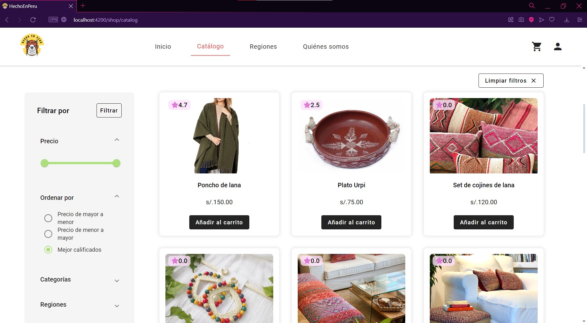
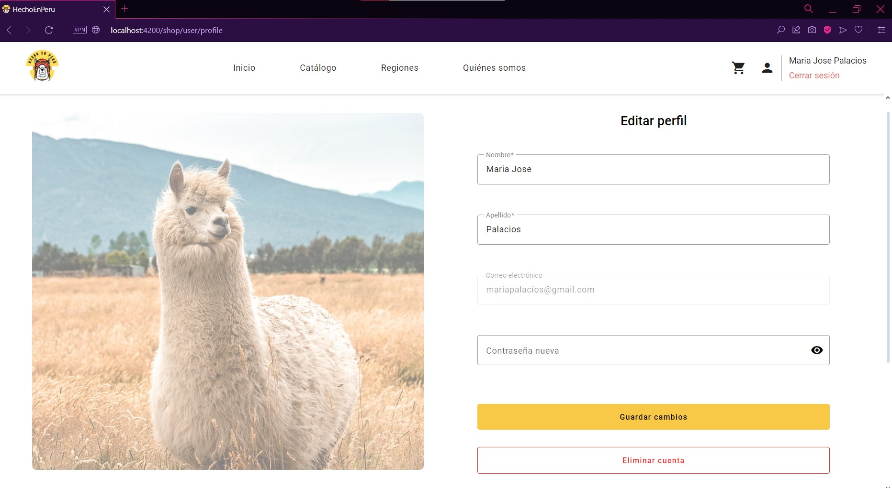
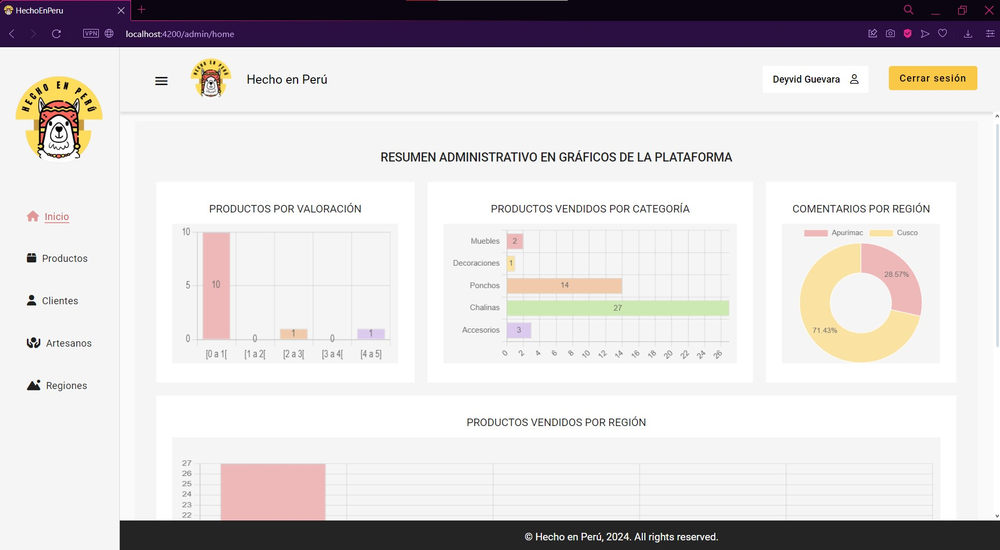
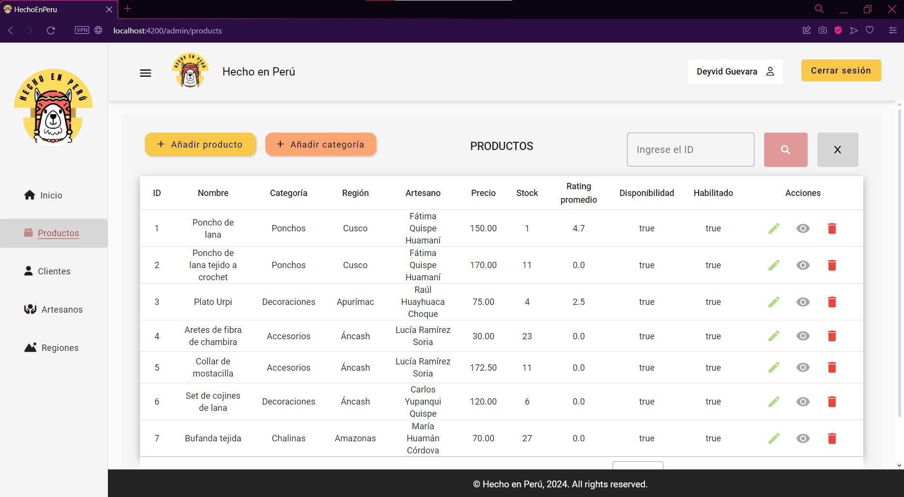
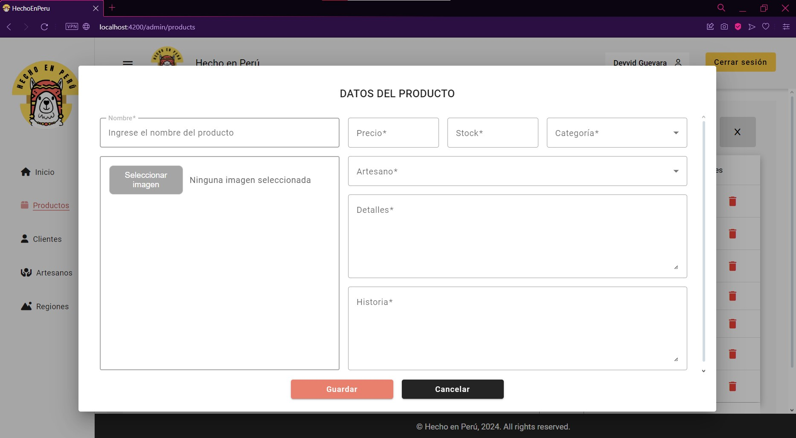

# 🦙 Hecho en Perú

Hecho en Perú es una tienda en línea de artesanías peruanas. El proyecto incluye una vista administrativa para la gestión de productos, clientes, artesanos y regiones, y está desarrollado con Angular para el frontend y Spring Boot para el backend.

## 📂 Repositorio del backend

https://github.com/GonzaloPA23/HechoEnPeru

## 📝 Descripción

Hecho en Perú es una plataforma integral que permite la gestión completa de una tienda de artesanías. Los usuarios pueden navegar y comprar productos, mientras que los administradores pueden gestionar todos los aspectos de la tienda a través de una interfaz administrativa.

## ✅ Funcionalidades

- **Gestión de Productos:** CRUD completo para productos.
- **Gestión de Clientes:** Listar y buscar clientes.
- **Gestión de Artesanos:** CRUD completo para artesanos.
- **Gestión de Regiones:** Crear y editar regiones.
- **Carrito de Compras:** Implementación de un carrito de compras con simulación de plataforma de pago.
- **Comentarios y Valoraciones:** Los clientes pueden interactuar mediante comentarios y valoraciones de productos.
- **Roles y Permisos:** Diferentes funciones disponibles según el rol del usuario.
- **Protección de Rutas:** Implementación de guards para proteger las rutas.
- **Despliegue:** El proyecto se desplegará en una instancia de AWS (en desarrollo).

## 💡 Tecnologías Utilizadas

- **Frontend:** Angular, Angular Material, Redux, SweetAlert, Routing, Guards
- **Backend:** Java Spring Boot
- **Base de Datos:** PostgreSQL
- **Lenguajes:** TypeScript, Java
- **Herramientas de Desarrollo:** Git, GitHub, AWS

## 🔨 Instalación

### Backend:

1. Clona el repositorio del backend:
  ```bash
  git clone https://github.com/GonzaloPA23/HechoEnPeru.git
  ```
2. Navega al directorio del proyecto:
  ```bash
  cd HechoEnPeru
  ```
3. Instala las dependencias:
  ```bash
  mvn install
  ```
4. Configura la base de datos PostgreSQL y actualiza las credenciales en el archivo `application.properties`.
5. Ejecuta la aplicación Spring Boot

### Frontend:

1. Clona el repositorio:
  ```bash
  git clone https://github.com/GwynethS/Hecho-en-Peru-Frontend.git
  ```
2. Navega al directorio del proyecto:
  ```bash
  cd Hecho-en-Peru-Frontend
  ```
3. Instala las dependencias
  ```bash
  npm install
  ```

## 👩🏻‍💻 Uso

1. Inicia sesión con las credenciales creadas en la base de datos.
2. Gestiona la plataforma con el rol ADMIN.
3. Interactúa con la plataforma como cliente con el rol USER para comprar productos, dejar comentarios y valoraciones.

## 📸 Ejecución

### Vista de cliente

Catálogo de Productos



Perfil de usuario



### Vista de administrador

Página de Inicio



Página de Productos



Añadir un producto


