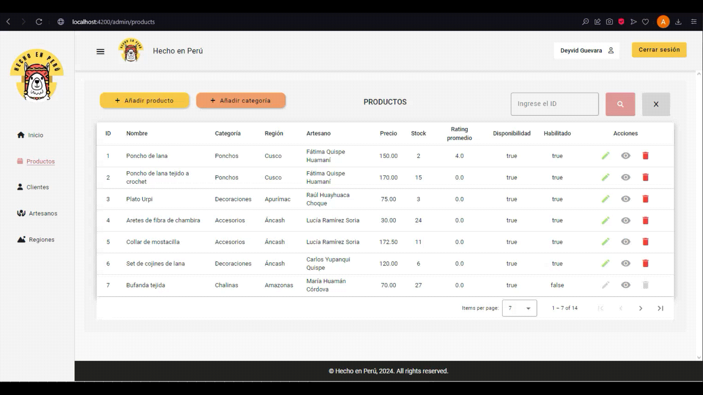
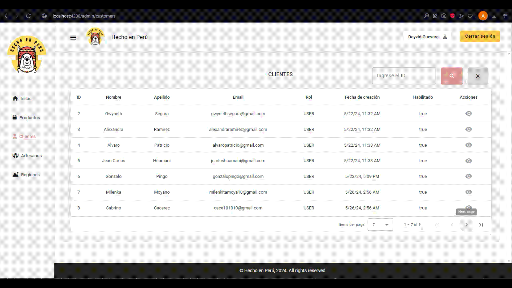
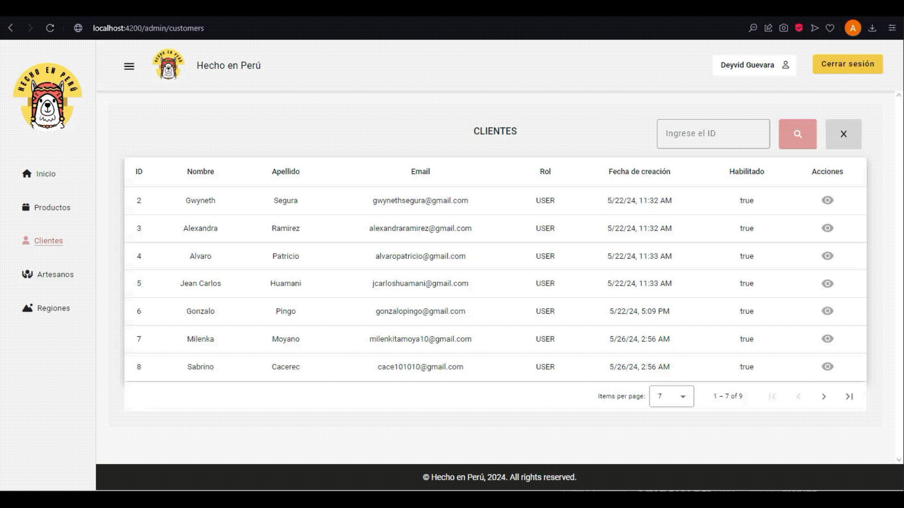

# 🦙 Hecho en Perú
Hecho en Perú es una tienda en línea de artesanías peruanas. El proyecto incluye una vista administrativa para la gestión de productos, clientes, artesanos y regiones, y está desarrollado con Angular para el frontend y Spring Boot para el backend. Este proyecto sigue la aplicación de una vista e-commerce desarrollada en el [repositorio Hecho en Perú](https://github.com/AlexandraRamirezz/Hecho-en-Peru).

## 📂 Repositorio del backend
https://github.com/GonzaloPA23/HechoEnPeru

## 📝 Descripción
Hecho en Perú es una plataforma integral que permite la gestión completa de una tienda de artesanías. Los usuarios pueden navegar y comprar productos, mientras que los administradores pueden gestionar todos los aspectos de la tienda a través de una interfaz administrativa.

## ✅ Funcionalidades
- **Gestión de productos:** CRUD completo para productos.
- **Gestión de clientes:** Listar y buscar clientes.
- **Gestión de artesanos:** CRUD completo para artesanos.
- **Gestión de regiones:** Crear y editar regiones.
- **Carrito de compras:** Implementación de un carrito de compras con simulación de plataforma de pago.
- **Comentarios y valoraciones:** Los clientes pueden interactuar mediante comentarios y valoraciones de productos.
- **Roles y permisos:** Diferentes funciones disponibles según el rol del usuario.
- **Protección de rutas:** Implementación de guards para proteger las rutas.
- **Despliegue:** El proyecto se desplegará en una instancia de AWS (en desarrollo).

## 💡 Tecnologías utilizadas
- **Frontend:** Angular, Angular Material, Redux, SweetAlert, Toastify, Chart.js, Routing, Guards
- **Backend:** Java Spring Boot
- **Base de Datos:** PostgreSQL
- **Lenguajes:** TypeScript, Java
- **Herramientas de Desarrollo:** Git, GitHub, Visual Studio Code, AWS

## 🔨 Instalación

### Backend:
1. Clona el repositorio del backend:
  ```bash
  git clone https://github.com/GonzaloPA23/HechoEnPeru.git
  ```
2. Navega al directorio del proyecto:
  ```bash
  cd HechoEnPeru
  ```
3. Instala las dependencias:
  ```bash
  mvn install
  ```
4. Configura la base de datos PostgreSQL y actualiza las credenciales en el archivo `application.properties`.
5. Ejecuta la aplicación Spring Boot

### Frontend:
1. Clona el repositorio:
  ```bash
  git clone https://github.com/GwynethS/Hecho-en-Peru-Frontend.git
  ```
2. Navega al directorio del proyecto:
  ```bash
  cd Hecho-en-Peru-Frontend
  ```
3. Instala las dependencias
  ```bash
  npm install
  ```

## 👩🏻‍💻 Uso
1. Inicia sesión con las credenciales creadas en la base de datos.
2. Gestiona la plataforma con el rol ADMIN.
3. Interactúa con la plataforma como cliente con el rol USER para comprar productos, dejar comentarios y valoraciones.

## 📸 Ejecución

### Vista de administrador
#### Página de inicio


#### CRUD de productos y listar por id


#### Crear y listar categorías


#### Listar y buscar clientes


#### Listar y buscar órdenes por cliente


#### CRUD de artesanos


#### Crear y editar regiones


### Vista de cliente
#### Registro


#### Inicio de sesión


#### Perfil de usuario


#### Página de inicio


#### Catálogo de productos


#### Detalles de un producto


#### Regiones


#### Detalles de una región


#### Quiénes somos


#### Carrito de compras


#### Proceso de compra

